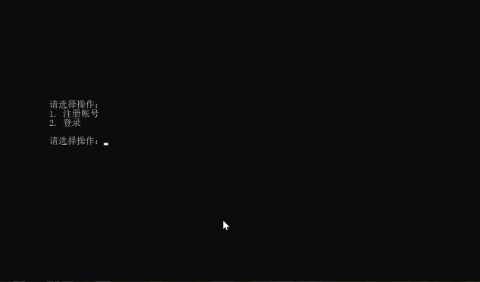
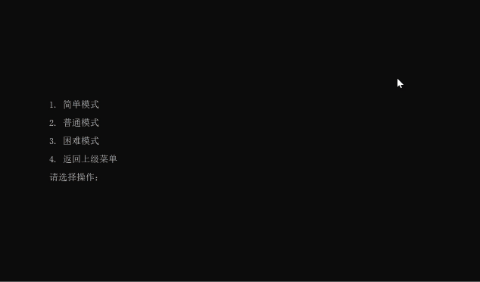
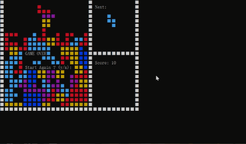

# Russia-Tetris（多人在线字符版俄罗斯方块）

## 项目简介

**Russia-Tetris** 是一款基于 Linux 的多人在线俄罗斯方块游戏，客户端通过 Telnet 连接即可游玩，无需安装任何客户端软件。支持登录、注册、成绩查询、排行榜等功能。

**主要功能：**

- **多人在线**：支持多个用户同时在线游戏。
- **登录与注册**：通过用户名和密码登录，也可注册新账号。
- **查询成绩**：登录后可查看自己最近 20 次成绩（含难度与分数）。
- **查询排行榜**：查询三种难度下全服 Top10 玩家（用户名、分数、获取时间）。
- **多种难度**：提供简单、普通、困难三种模式。

游戏规则：通过方向键移动、空格键旋转方块，使方块排列成完整的一行或多行并消除得分。

## 技术栈

| 技术 | 说明 |
|------|------|
| libevent | 事件通知库，核心网络框架 |
| spdlog | C++ 日志库 |
| Socket | TCP 网络编程 |
| C++17 | 开发语言标准 |

> 注：早期版本基于 epoll 实现事件循环，现已全面迁移至 libevent。

## 目录结构

```
Russia-Tetris/
├── src/                      # 源代码目录
│   ├── Common/               # 通用头文件、宏定义、状态枚举
│   ├── ConnectionPool/       # 用户对象连接池（对象复用与性能优化）
│   ├── EventLoop/            # 核心网络框架（libevent 事件循环）
│   ├── TetrisGame/           # 游戏核心逻辑
│   │   ├── Game.h/.cpp       # 方块移动、旋转、消行、计分等游戏逻辑
│   │   ├── Server.h/.cpp     # 登录与注册逻辑
│   │   ├── User.h/.cpp       # 当前用户信息与状态管理
│   │   ├── PlayerInfo.h/.cpp # 已注册用户信息管理
│   │   └── Filedata.h/.cpp   # userdata.csv 数据读写
│   ├── UImanage/             # 界面管理（TUI）
│   ├── Utility/              # 工具函数与系统优化
│   ├── main.cpp              # 程序入口
│   ├── makefile              # 构建脚本
│   └── optimize_system.sh    # 系统调优脚本
├── images-and-gif/           # 演示截图与 GIF
├── tests/                    # 并发压测脚本
└── README.md                 # 项目说明
```

## 安装与使用

### 1. 克隆仓库

```bash
git clone git@github.com:22222sss/Russia-Tetris.git
```

### 2. 安装依赖

Ubuntu / Debian 下一条命令安装全部依赖：

```bash
sudo apt update
sudo apt install -y g++ make libevent-dev libspdlog-dev libfmt-dev
```

### 3. 编译

```bash
cd Russia-Tetris/src
make
```

编译成功后会在 `src/` 目录下生成可执行文件 `tetris_game`。

### 4. 运行服务器

```bash
./tetris_game
```

### 5. 客户端连接

在客户端终端（cmd / PowerShell / Linux 终端）输入：

```bash
telnet <服务器IP> 9999
```

- 查询服务器 IP：Linux 下执行 `ifconfig` 或 `ip addr`。
- 端口号位于 `src/Common/Common.h` 的 `DEFAULT_PORT` 宏定义中，默认 9999，可自行修改。

## 项目展示

#### 登录注册界面


#### 登录成功后查看最近 20 次成绩与各难度 Top10 排行榜



#### 游戏模式

**简单模式**（方块下降间隔 1 秒）



**普通模式**（方块下降间隔 0.5 秒）


**困难模式**（方块下降间隔 0.2 秒）


#### 游戏结束后返回初始菜单



## 并发性能测试

服务端程序的核心指标之一是**并发连接数**。本项目提供了自动化压测脚本 `tests/load_test.py`，并在 32 核 / 126GB 内存的容器环境（客户端与服务端同机 loopback）中进行了实测。

**测试方法**

- 使用 Python asyncio 编写压测客户端，通过两个 loopback IP（`127.0.0.1` / `127.0.0.2`）各承担一半连接，突破单 IP 约 6.4 万个源端口的限制。
- 客户端分批建立 TCP 连接，连接成功后读取服务端下发的欢迎界面，验证数据收发是否正常。

**实测结果**

| 指标 | 结果 |
|------|------|
| 目标并发连接数 | 100,000 |
| 实际建立连接数 | **99,893**（成功率 99.9%） |
| 收到欢迎数据的连接 | **99,893**（99.9%） |
| 失败连接数 | 107 |
| 服务端内存占用 | 约 400 MB |

**结论**

- 服务端可同时建立并保持约 **10 万个 TCP 连接**，连接成功率达 **99.9%**。
- **有效服务并发接近 10 万**：99.9% 的连接能在超时内及时收到服务端下发的欢迎数据。

**性能优化**

实测过程中定位并修复了一个关键性能缺陷：两个 100ms 定时器回调通过 `getAllUsers()` **按值返回复制整个用户 map**，在 10 万连接下每 100ms 复制 10 万个 `shared_ptr`，导致服务端 CPU 打满、数据下发严重延迟。改为锁内遍历（`forEachUser`）后，有效服务并发从约 5 万提升到接近 10 万。

此外还应用了以下优化：

1. **异步日志**：`spdlog` 异步工厂 + 大队列 + 生产环境 `warn` 级别，消除同步写盘阻塞。
2. **合并 send**：将界面清屏的 240 次循环和多次小 `send` 合并为单次发送，减少系统调用次数。
3. **正确处理 EAGAIN**：非阻塞 socket 发送缓冲区满时不再误关连接。

**剩余瓶颈**

- **单线程事件循环**：accept、数据处理仍在同一线程内串行执行，无法利用多核 CPU。进一步突破需引入多线程事件循环（例如每个 worker 线程一个 `event_base`）。

## 致谢

`Russia-Tetris` 的诞生离不开开源软件和社区的支持，感谢以下开源项目及项目维护者：

- spdlog：https://github.com/gabime/spdlog
- libevent：https://github.com/libevent/libevent
- 业务参考项目：https://blog.csdn.net/chenlong_cxy/article/details/119680671

## 支持一下

如果觉得这个项目还不错，点个 ⭐ Star，这将是对 **Russia-Tetris** 极大的鼓励与支持。
